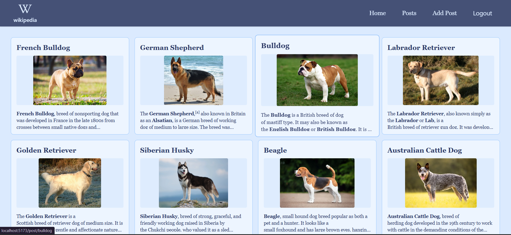

# Mini Wikipedia Platform

A mini Wikipedia-based platform built with React and Appwrite, allowing users to interact with wiki-like content. The app features rich text editing, dynamic content rendering, and user authentication.

[Live Demo on Vercel](https://wikipedia-tan.vercel.app/)  
[GitHub Repository](https://github.com/TheGitaPrince/Wikipedia)

---

---

## Screenshot

---

## Features

- User authentication and data management via Appwrite  
- Rich text editing with TinyMCE React component  
- Dynamic rendering of HTML content using html-react-parser  
- Form management using React Hook Form  
- Navigation with React Router DOM  
- Iconography with React Icons  
- State management through Redux Toolkit and React Redux  

---

## Dependencies

| Package              | Purpose                                 |
|----------------------|-----------------------------------------|
| react                | UI framework                           |
| appwrite             | Backend as a service integration       |
| @tinymce/tinymce-react | Rich text editor                      |
| html-react-parser    | HTML content parsing                    |
| react-hook-form      | Form handling                          |
| reduxjs/toolkit      | State management                       |
| react-redux          | React bindings for Redux               |
| react-router-dom     | Routing                               |
| tailwindcss          | CSS utility framework                  |

Dev dependencies include Vite, ESLint, PostCSS, Tailwind CSS, and TypeScript typings.

---

## Usage Notes

- User auth and data storage are handled via Appwrite SDK  
- Rich text content is created and edited using TinyMCE  
- React Hook Form manages form state and validation  
- Dynamic rendering of wiki content leverages parsed HTML elements  
- Navigation uses React Router DOM to create a multi-page experience  

---

Enjoy exploring the mini Wikipedia platform! 📚
